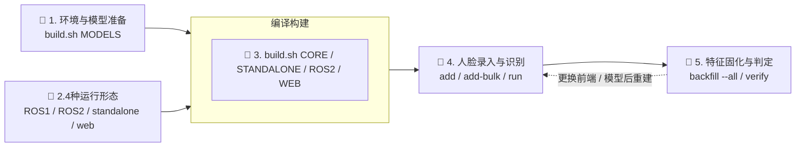
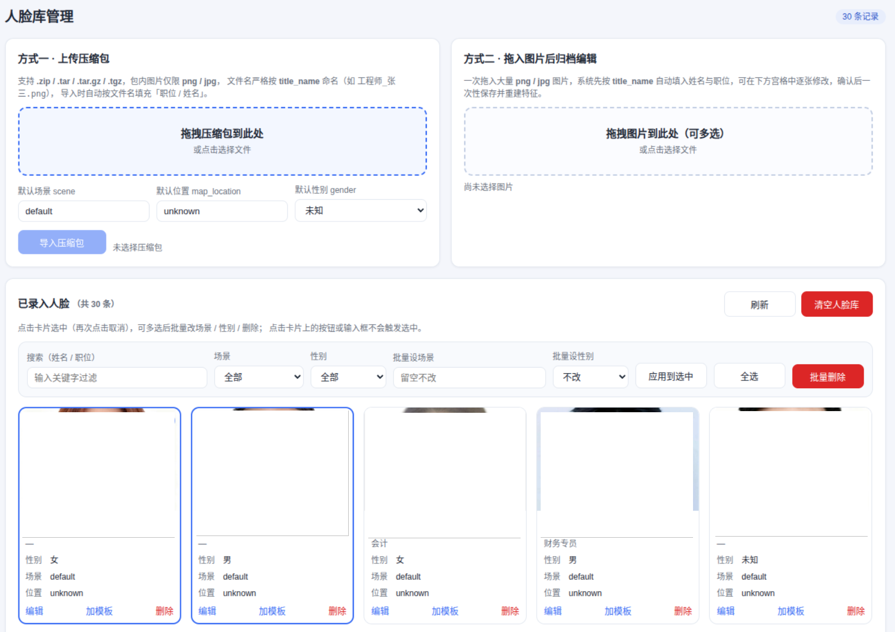

<div align="center">


# Face Recognition Node

## 本地离线实时人脸检测与识别系统，四种运行形态复用同一核心算法库
</div>

---
<p>
  
  
  
  
  
  
  
  
  <a href="LICENSE"></a>
</p>

## 项目介绍

**Face Recognition Node** 是面向**机器人控制 / 边缘设备部署**的实时人脸检测识别工程，基于 **C++17 + ONNX Runtime + OpenCV + SQLite3** 开发，适配 **Ubuntu 20.04 / 22.04 与 Jetson（aarch64）**，聚焦**本地离线运行、一人多模板、多通路共享同一人脸库**的实用识别场景。

检测使用 **SCRFD（`det_10g.onnx`）**，一次前向同时输出边界框、置信度与 5 点关键点；识别使用 **ArcFace（`w600k_r50.onnx`）**，输出 **512 维 L2 归一化 embedding**，比对即余弦相似度。取脸默认走 5 点关键点对齐（`norm_crop`），把姿态归一化到标准正脸模板后再提特征。

### 核心功能

- **人脸检测与关键点定位**：SCRFD 单模型输出框 + 5 点关键点；letterbox 等比预处理避免人脸拉伸；后处理按输入尺寸自适应推导 anchor 层，`--input-size` 可自由调整（N 减半约 4× 提速）。同时兼容 YOLOv8 单输出模型作为备用 backend。
- **人脸特征提取与 verify 判定**：`extract_embedding()` 输出 512 维特征（存库为 2048 字节 BLOB）。取脸有**对齐 / bbox 裁剪两个前端**（默认对齐，`--no-align` 可切），前端变更后必须重建特征。判定链路是「检测 → 取脸 → 提特征 → 全库排名 → 队列归一化 → 阈值判定」，`verify --image` 把这条链路的每一步分数与拒绝原因都打印出来，是排查识别问题的第一手段。
- **人脸库与匹配**：单个 SQLite 文件存身份（`id` / `name` / `title` / `scene` / `map_location` / 512 维 `embedding`）与**任意多张附加模板**；匹配取一个身份下所有模板的最高分，因此补一枪"不戴眼镜 / 侧脸"即可覆盖真实外观变化。附加队列归一化（median/MAD → z 分数）抑制低质量模板"乱认人"。
- **四种运行形态**：ROS2 节点（含 viewer 与 MJPEG 推流）、ROS1 节点、**零 ROS 依赖的 standalone CLI**（摄像头 / RTSP / HTTP / 视频文件 / 图片目录）、Web 人脸库后台。四者复用同一个 `face_recognition_core`，模型权重与数据库 100% 互通。
- **工程化能力**：`build.sh` 一键构建与依赖检查；第三方 C/C++ 依赖 vendoring（SQLite3 强制开启 R-Tree/GEOPOLY）；核心库以 CMake 安装 + RPATH 解析，对系统目录零写入；`backfill --all` 作为"特征空间迁移"的标准手段。

## Pipeline Overview



## Quick Start

### 🔧 1. 源码开发快速开始 [[Doc](docs/setup.md)]

依赖 ONNX Runtime（C++）、OpenCV ≥ 4.5、SQLite3、libuuid；ROS 目标额外需要 ROS1 Noetic 或 ROS2 Humble。
支持 **Ubuntu 20.04 / 22.04** 与 **Jetson aarch64**，**不支持 Windows**；推荐直接在目标机器上构建（第三方依赖走 vendoring，不写系统目录）。

详见 [源码开发快速开始](./docs/setup.md)。

### 🤖 2. 专项模块快速开始 [[Doc](docs/module/quick_start.md)]

项目含 **5 个可独立构建的应用层模块 + 1 个公共核心库**：核心算法库、standalone CLI、ROS2 节点、ROS1 节点、Web 人脸库后台。每个模块的最短跑通路径见该文档。

详见 [模块快速开始](./docs/module/quick_start.md)。

### 🔨 3. 编译运行

用**Web 后台可视化传图录入**，再用实时识别程序验证 —— 全程不需要记 CLI 参数。

```bash
# 1. 克隆项目代码
git clone <项目仓库地址>
cd face_recognition

# 2. 下载模型（首次必须）
./build.sh MODELS

# 3. 构建「Web 人脸库后台」与「非 ROS 实时识别程序」
./build.sh WEB
./build.sh STANDALONE
# 等价于：make -C build/standalone -j$(nproc)

# 4. 启动 Web 人脸库后台（与实时识别共用同一个 SQLite 库）
APP=./install/bin/face_recognition_app
$APP web --port 8080
# 也可直接启动：
# ./install/bin/face_db_web --port 8080 \
#     --db /data/hhqs_data/face_db/faces.db --faces-dir /data/hhqs_data/face_db/faces \
#     --detection-model "$PWD/models/det_10g.onnx" \
#     --recognition-model "$PWD/models/w600k_r50.onnx"

# 5. 浏览器打开 http://localhost:8080/
#    在 “Add Face” 表单里传图录入：
#      · Name 必填，可另填 Title / Scene / Map Location
#      · “Or Upload” 选本地照片（也可在 “Image URL” 填图片链接）
#      · 点 “Add Face”，提示 Face added with embedding 即为成功
#      · 下方 “Face List” 会实时出现该人及其缩略图

# 6. 另开一个终端，启动实时识别（默认 USB 摄像头 /dev/video0）
$APP run --source 0
```

> **接了多个摄像头 / 需要指定分辨率帧率时**，先列出本机设备再按编号选择：
>
> ```bash
> $APP cameras                                          # 编号 / 设备名 / 当前采集模式
> $APP run --camera 0 --width 1280 --height 720 --fps 30
> ```
>
> `--camera` 会用 `/dev/video*` 校验，写错立即报错并提示可用编号；
> 720p 以上会自动协商 MJPG，避免未经压缩的 YUYV 掉到个位数帧率。

**Web 端demo显示效果：**
<div align="center">

</div>

> Web 端录入时**已完成人脸检测与特征提取**，`embedding` 随记录一起写入数据库，
> 因此录入完直接打开实时识别即可，无需再做任何额外操作。
>
> 若录入时提示 `Refused: no embedding could be extracted`，说明 Web 服务没找到模型：
> 在项目根目录启动，或按上面注释显式传 `--detection-model` / `--recognition-model`。
>
> —— 详见 [模块快速开始](./docs/module/quick_start.md) 与
> [standalone 使用文档](./docs/module/standalone.md)。

其他构建目标：`./build.sh CORE` / `ROS2` / `ROS1` / `WEB` / `ALL` / `CLEAN`。
ROS2 启动：`source scripts/setup_env.sh && ros2 launch face_recognition_ros2 usb_cam_face.launch.py`。

> **升级过版本 / 更换过模型时**，库内旧特征与当前取脸前端可能不在同一特征空间，
> 需要重建一次：`$APP backfill --all`（直接用存档缩略图重算，不必重新传图）。

### 🧪 4. 功能验证（可选）

项目当前**没有独立的单元测试工程**，端到端验证以"**Web 录入 → 实时识别**"这条通路为主：

```bash
# ① 在 Web 页面拖入自己的照片，核对姓名后点击卡片选中 → 「按勾选项重建入库」
# ② 启动实时识别，正对摄像头：画面上应显示你的名字与相似度
$APP run --source 0

# ③ 换一个人（或戴上面具 / 转到侧脸）确认不会被误认成你
```

需要**量化判定的中间分数**时，再用 CLI 的 `verify` 逐张打分（它会打印排名、
原始相似度、队列统计与拒绝原因）：

```bash
$APP verify --image /path/to/your_photo.jpg        # 本人：应 ACCEPT
$APP verify --image /path/to/other_person.jpg      # 他人：应 REJECT

# 批量校验（适合回归验证）
for f in ./test_image/*.png; do
  printf '%-24s ' "$f"
  $APP verify --image "$f" | grep -E 'raw similarity|decision' | tr '\n' ' '
  echo
done
```

判读要点：**同一人的分数应明显高于其他人，且其他人的分数应落在低位区间
（接近 0 或负值）。若两者区间重叠，属于特征 / 取脸前端问题，调阈值无效**——
参见 [常见问题排查](./docs/FAQ/troubleshooting.md)。

### 📄 5. 协议/配置文档 [[Doc](docs/protocol/)]

覆盖 ROS Topic / Service / Message、Web HTTP API 与 MJPEG 推流接口、SQLite 表结构与数据字典
（512 维 embedding 的二进制布局、`id` / `name` 等字段语义）、全项目配置项与默认值。

详见 [协议/配置文档](./docs/protocol/)。

### 📦 6. 正式发布 [[Doc](docs/release_guide.md)]

说明版本号规则、发布分支与流程、发布前检查清单、Release Notes 模板。

```bash
# 基础发布命令示例（本仓库未内置发布脚本，按文档流程执行）
git checkout master
git pull
# 修改版本配置文件后打标签
git tag -a vX.Y.Z -m "release vX.Y.Z"
```

详见 [发布指南](./docs/release_guide.md)。

## 项目结构

```
face_recognition/
├── LICENSE                         # Apache-2.0
├── build.sh                        # 唯一构建入口（MODELS/CORE/ROS1/ROS2/STANDALONE/WEB/ALL/CLEAN）
│
├── src/                            # ★ 只放源码：构建产物一律不落在包目录里
│   ├── face_recognition_core/      # 核心算法库：FaceDetector / FaceRecognizer / FaceDatabase
│   │   ├── include/face_recognition_core/
│   │   │   ├── types.hpp           # 数据类型 + compute_similarity
│   │   │   ├── face_detector.hpp
│   │   │   ├── face_recognizer.hpp
│   │   │   └── face_database.hpp
│   │   └── src/
│   ├── face_recognition_standalone/# 零 ROS 依赖的实时识别 CLI
│   │   ├── include/face_recognition_standalone/
│   │   └── src/                    # main / cli / recognition_pipeline / video_source / camera
│   ├── face_recognition_ros2/      # ROS2 节点（node / viewer / face_stream_server）
│   ├── face_recognition_ros2_interfaces/   # ROS2 msg / srv
│   ├── face_recognition_ros1/      # ROS1 节点
│   ├── face_recognition_ros1_interfaces/   # ROS1 msg / srv
│   └── face_db_web/                # Web 人脸库后台（HTTP + 页面）
│
├── build/                          # ★ 中间构建树，按目标分目录（不纳入版本库）
│   ├── core/  web/  standalone/    #   各 CMake 目标的构建树
│   ├── vendored/                   #   vendored SQLite3 / SpatiaLite
│   └── ros1/  ros2/                #   catkin / colcon 工作空间
│
├── install/                        # ★ 唯一产物目录：用户只从这里取二进制
│   ├── bin/                        #   face_recognition_app / face_db_web
│   ├── lib/                        #   libface_recognition_core.so*
│   ├── include/face_recognition_core/   # 对外头文件
│   ├── vendored/                   #   项目内 SQLite3（R-Tree / GEOPOLY）
│   ├── share/face_db_web/          #   Web 页面模板
│   └── ros2/                       #   ROS2 colcon 安装空间（与上面隔离）
│
├── models/                         # ONNX 模型（检测/识别/备用），见 models/README.md
├── docs/                           # 全量项目文档（入口 docs/README.md）
│   ├── setup.md                    # 开发环境搭建与首次跑通
│   ├── architecture.md             # 分层、数据流、存储模型、关键设计决策
│   ├── release_guide.md            # 版本与发布流程
│   └── protocol/ services/ module/ peripheral/ FAQ/ img/
├── scripts/                        # setup_env.sh / download_models.py 等辅助脚本
└── third_party/                    # vendored 依赖源码（sqlite3 / spatialite / libmicrohttpd）
```

## 参考项目与致谢

本项目的算法前端、依赖与运行生态大量借鉴 / 依赖以下开源工作，特此致谢。
**逐文件的上下游对照表**（含已确认的差异与待办）见
[third_party/REFERENCE.md](third_party/REFERENCE.md)。

### 论文 / 算法出处

- **ArcFace** — Deng et al., *ArcFace: Additive Angular Margin Loss for Deep Face Recognition*，<https://arxiv.org/abs/1801.07698>
- **SCRFD** — Guo et al., *Sample and Computation Redistribution for Efficient Face Detection*，<https://arxiv.org/abs/2105.04714>
- **RetinaFace** — Deng et al., *RetinaFace: Single-stage Dense Face Localisation in the Wild*，<https://arxiv.org/abs/1905.00641>
- **SFace** — Zhong et al., *SFace: Sigmoid-Constrained Hypersphere Loss for Robust Face Recognition*，<https://arxiv.org/abs/2205.12041>
- **YuNet** — Wu et al., *YuNet: A Tiny Millisecond-level Face Detector*, Machine Intelligence Research 2023，<https://link.springer.com/article/10.1007/s11633-023-1423-y>

> 参考实现（`insightface/`、`opencv_zoo/`）只用于比对定位偏差，**不参与构建**：
> 用 `./third_party/fetch_reference.sh` 拉取，详细说明见 [third_party/README.md](third_party/README.md)。

## 许可证

本项目以 **[Apache License 2.0](LICENSE)** 开源发布：  
```text
Copyright 2026 Face Recognition Node Authors

Licensed under the Apache License, Version 2.0 (the "License");
you may not use this file except in compliance with the License.
You may obtain a copy of the License at

    http://www.apache.org/licenses/LICENSE-2.0
```

### 第三方组件与模型权重

Apache-2.0 只覆盖**本仓库自行编写的代码**。第三方依赖、以及**下载**得到的模型权重（`models/` 不在仓库内）各自遵循其上游许可：
- **SQLite3（Public Domain）**
- **OpenCV（Apache-2.0）**
- **ONNX Runtime（MIT）**
- **libmicrohttpd（LGPL-2.1+）**
- **SpatiaLite（MPL-1.1 / GPL-2.0+）**
- **util-linux（BSD-3-Clause）**
- **Ultralytics YOLOv8（AGPL-3.0）**

> ⚠️ **默认模型权重不可商用**：`det_10g.onnx` / `w600k_r50.onnx` 来自 [InsightFace](https://github.com/deepinsight/insightface) 的
> `buffalo_l` 包，上游声明**仅供非商业研究**。若要把本项目用于商业场景，请改用
> Apache-2.0 的 [OpenCV Zoo](https://github.com/opencv/opencv_zoo)（YuNet + SFace）
> 或自行训练 / 采购授权的模型，再按 [常见问题排查](docs/FAQ/troubleshooting.md) 的
> 流程重跑 `backfill --all` 重建特征库。
