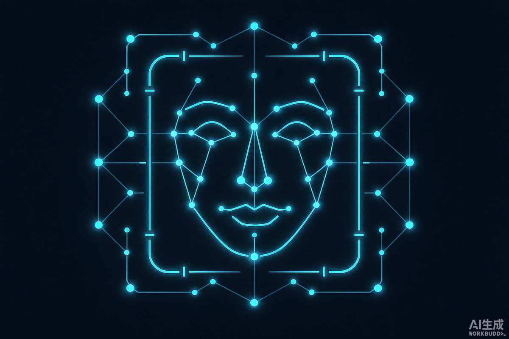
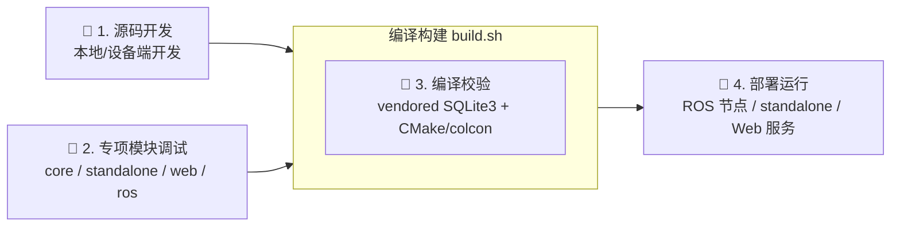

<!-- <div align="center">
 -->

# Face Recognition Node

## 基于 YOLOv8/RetinaFace + ArcFace 的 ROS1/ROS2 双版本人脸识别节点，含非 ROS 实时识别与 Web 人脸库管理

---
<!-- 技术栈徽章：按需替换，支持Python、C++、系统、框架、硬件、容器等 -->
[](#)
[](#)
[]()
[](#)
[](#)
[](#)
[](#)
[](#)
[]()
</div>

## 项目介绍

**Face Recognition Node** 是面向【机器人控制 / 边缘视觉感知 / 门禁考勤等业务系统】的人脸识别核心工程，
基于【C++17 + RetinaFace / YOLOv8-Face 检测 + ArcFace 512 维特征 + SQLite3 + ROS1/ROS2】开发，
适配【Ubuntu 20.04（Noetic）/ Ubuntu 22.04（Humble）/ Jetson Orin 系列 aarch64】，
聚焦【检测、识别、人脸库管理的一体化离线部署与跨平台可复现编译】。

所有 C/C++ 第三方依赖（SQLite3、SpatiaLite）均 **vendoring 到 `third_party/`，不修改系统任何库**，
可一键在 x86_64 与 aarch64 平台复现编译。

### 核心功能

- **人脸检测（基础能力）**：内置 RetinaFace（`det_10g.onnx`，9 输出 + 5 点关键点）与
  YOLOv8（单输出 `[1, 84, N]`）双 backend，**按模型输出自动判定**，含自定义贪心 NMS
  与置信度截断，单帧最多 10 张人脸。
- **人脸识别（基础能力）**：ArcFace `w600k_r50.onnx` 提取 512 维 L2 归一化 embedding，
  与 SQLite 人脸库做 1:N 余弦相似度检索，返回姓名、职位、场景、位置与相似度。
- **非 ROS 实时识别（适配能力）**：`face_recognition_standalone` 是**零 ROS 依赖**的
  C++17 可执行，支持 USB 摄像头 / RTSP / HTTP-MJPEG / 视频文件 / 单图 / 图片目录六种输入源，
  支持 headless、MP4 录制、自动抓拍、纯检测模式；复用与 ROS 版本**完全相同**的核心库，
  检测精度与数据库 100% 互通。
- **ROS 接口（扩展能力）**：ROS1 Noetic 与 ROS2 Humble 双版本，提供 **4 个 Service
  （`/face_db/{add,remove,list,clear}`）+ 2 个 Topic（`/image_raw` 订阅、
  `/face/recognition_result` 发布）**，ROS2 额外提供 `face_viewer_node`（标注图发布）
  与 `face_stream_server`（HTTP MJPEG 推流）。
- **Web 人脸库管理（基础能力）**：基于 libmicrohttpd 的 HTTP 服务，浏览器可视化
  增 / 删 / 查 / 清空，支持 URL 图片与本地上传，**录入时自动检测人脸并提取特征**。
- **人脸库统一存储（核心优势）**：Web / ROS / standalone 三路共用同一份 SQLite schema，
  默认均指向 `/tmp/face_db/faces.db`，**任一处录入即可被其余通路立即识别**；
  提供 `backfill` / `--auto-backfill` 自动补齐缺失特征。
- **第三方框架与中间件对接**：OpenCV ≥ 4.5（图像处理与 ArcFace 推理）、
  ONNX Runtime C++（RetinaFace 推理，解决 OpenCV DNN 无法执行动态 Reshape 的问题）、
  SQLite3 amalgamation（启用 R-Tree / GEOPOLY / FTS5 / JSON1，消除
  `undefined symbol: sqlite3_rtree_query_callback`）、libmicrohttpd（HTTP / MJPEG）、
  ROS1/ROS2（`cv_bridge` / `image_transport` / `ament_cmake` / `catkin`）。

## Pipeline Overview



## Quick Start

### 🔧 1. 源码开发快速开始 [[Doc](docs/setup.md)]

核心依赖：`cmake` / `make` / `g++`（C++17）、`libopencv-dev ≥ 4.5`、`uuid-dev`、
`libsqlite3-dev`、**ONNX Runtime C++**；构建 Web 后台需额外 `libmicrohttpd-dev`；
构建 ROS 节点需对应版本的 `ros-humble-*` / `ros-noetic-*` 包。
推荐使用一键脚本 `./build.sh`（内部自动构建 vendored SQLite3 并按需 walk-up 探测
`third_party/`）；**不支持**绕过 vendored 依赖直接修改系统库的构建方式。

详见 [源码开发快速开始](./docs/setup.md)。

### 🤖 2. 专项模块快速开始 [[Doc](docs/module/quick_start.md)]

项目由 **核心算法库 + 4 个应用层模块** 组成，每个模块均可独立构建与调试：
`face_recognition_core`（公共库）、`face_recognition_standalone`（零 ROS 实时识别 CLI）、
`face_recognition_ros2`（节点 + viewer + MJPEG 推流）、`face_recognition_ros1`（单节点）、
`face_db_web`（Web 人脸库后台）。各模块最短跑通路径与推荐组合工作流见文档。

详见 [模块快速开始](./docs/module/quick_start.md)。

### 🔨 3. 编译运行

```bash
# 1. 克隆项目代码
git clone 项目仓库地址
cd face_recognition
git submodule update --init --recursive

# 2. 加载环境依赖（按需保留）
source /opt/ros/humble/setup.bash          # ROS2 目标需要

# 3. 下载模型 + 工程编译
./build.sh MODELS                          # 下载 det_10g.onnx + w600k_r50.onnx（必须）
./build.sh ROS2                            # 或 CORE / ROS1 / STANDALONE / WEB / ALL

# 4. 启动运行（ROS2 + USB 摄像头 + 浏览器查看）
source scripts/setup_env.sh
ros2 launch face_recognition_ros2 usb_cam_face.launch.py
# 浏览器打开 http://localhost:8090/
```

分模块启动示例：

```bash
# 非 ROS 实时识别（无需 source ROS 环境）
./src/face_recognition_standalone/build/face_recognition_app run --source 0

# Web 人脸库管理后台
./install/bin/face_db_web --port 8080 \
    --db /tmp/face_db/faces.db --faces-dir /tmp/face_db/faces
```

构建产物：`install/`（核心库 / ROS2 包 / `bin/face_db_web` / `vendored/lib`）、
`src/face_recognition_standalone/build/face_recognition_app`、
`src/face_recognition_ros1/devel/`。构建日志见 `build.log`。

### 🧪 4. 单元测试/模块测试（可选）

```bash
# ROS2 包静态检查（ament_lint）
colcon test --packages-select face_recognition_ros2 --event-handlers console_direct+
colcon test-result --verbose

# 离线功能验证（不依赖 ROS 与摄像头）
APP=./src/face_recognition_standalone/build/face_recognition_app
$APP add --image ./test_2.png --name test_person --scene test
$APP list                                    # 期望 emb=yes
$APP run --source ./test_2.png --no-display  # 期望检测到人脸并输出相似度
```

### 📄 5. 协议/配置文档 [[Doc](docs/protocol/)]

覆盖 ROS Topic / Service / Message 定义、人脸库 HTTP API 与 MJPEG 推流接口、
SQLite 数据库 schema 与数据字典、全项目配置项与默认路径约定。

详见 [协议/配置文档](./docs/protocol/)。

### 📦 6. 正式发布 [[Doc](docs/release_guide.md)]

采用语义化版本 `MAJOR.MINOR.PATCH`，版本号同步维护于各 `package.xml` 与
`face_recognition_core/CMakeLists.txt`（含 `SOVERSION`）；发布前需完成
`./build.sh CLEAN` 后全量构建、离线功能验证与 vendored 依赖校验。

```bash
# 基础发布命令示例
git checkout main
git pull --rebase
# 修改各 package.xml / CMakeLists.txt 中的版本号后提交
git commit -am "chore(release): bump version to v1.0.0"
git tag -a v1.0.0 -m "Face Recognition Node v1.0.0"
git push origin main
git push origin v1.0.0
```

详见 [发布指南](./docs/release_guide.md)。

## 项目结构

```
face_recognition/
├── build.sh                        # 一键构建入口（MODELS/CORE/ROS1/ROS2/STANDALONE/WEB/ALL/CLEAN）
├── README.md
├── models/                         # ONNX 模型权重（./build.sh MODELS 下载）
├── data/                           # 本地人脸库数据（SQLite 库 + 缩略图）
├── docs/                           # 全量项目文档
│   ├── setup.md                    # 开发环境搭建
│   ├── architecture.md             # 架构说明
│   ├── protocol/                   # 协议、接口、通信文档
│   ├── services/                   # 核心业务模块文档
│   ├── peripheral/                 # 外设、依赖适配文档
│   ├── module/                     # 专项模块文档
│   ├── FAQ/                        # 常见问题排查
│   ├── img/                        # 文档与 README 图片资源
│   └── release_guide.md            # 发布指南
├── scripts/                        # 编译、部署、发布、辅助脚本
│   ├── download_models.py          # 模型下载
│   ├── setup_env.sh                # 注入 vendored 库 + ROS 环境
│   └── fix_retinaface_onnx.py      # 模型修复工具
├── src/
│   ├── face_recognition_core/      # 核心底层算法库（检测/识别/人脸库）
│   ├── face_recognition_ros2/      # ROS2 节点 + viewer + MJPEG 推流
│   ├── face_recognition_ros2_interfaces/  # ROS2 msg/srv 定义
│   ├── face_recognition_ros1/      # ROS1（Noetic）节点
│   ├── face_recognition_ros1_interfaces/  # ROS1 msg/srv 定义
│   ├── face_recognition_standalone/ # 非 ROS 实时识别 CLI（零 ROS 依赖）
│   └── face_db_web/                # Web 人脸库管理后台
├── third_party/                    # 第三方依赖、SDK、开源库（vendoring）
│   ├── sqlite3/                    # SQLite amalgamation（R-Tree/GEOPOLY）
│   ├── spatialite/                 # SpatiaLite（可选，默认关闭）
│   └── libmicrohttpd/              # libmicrohttpd（可选，默认用系统包）
└── install/                        # colcon / cmake 安装产物
    ├── bin/                        # face_db_web 等可执行文件
    └── vendored/                   # 项目内第三方库安装前缀
```

## 许可证

本项目采用 **MIT 许可证**（见各 `package.xml` 的 `<license>MIT</license>`）。

第三方组件遵循各自原始许可，使用时请一并遵守：

| 组件 | 许可 |
|---|---|
| SQLite3（amalgamation） | Public Domain |
| SpatiaLite（可选项） | MPL 1.1 / GPL 2.0 / LGPL 2.1 三选一 |
| libmicrohttpd | LGPL 2.1+ |
| OpenCV | Apache-2.0 |
| ONNX Runtime | MIT |
| ROS1 / ROS2 | Apache-2.0 / BSD |

模型权重版权归原作者所有：检测与识别模型来自
[deepinsight/insightface](https://github.com/deepinsight/insightface)，
通用检测模型来自 [ultralytics/ultralytics](https://github.com/ultralytics/ultralytics)，
仅供研究与非商业用途，商用请自行确认授权。

## 参考

- [heyouzen/ros2-face-recognition](https://github.com/heyouzen/ros2-face-recognition)
- [deepinsight/insightface](https://github.com/deepinsight/insightface)
- [ultralytics/ultralytics](https://github.com/ultralytics/ultralytics)
